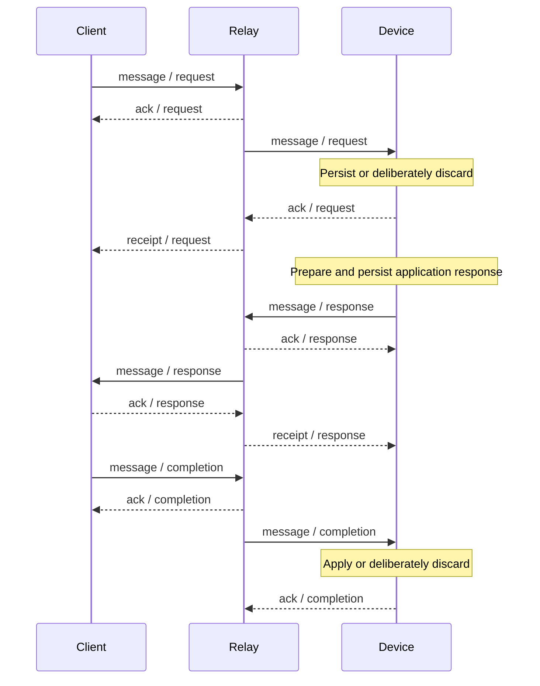

# Agentknock v1 device-relay protocol

This document defines the protocol between an Agentknock device and a relay.
It covers device registration, authenticated connections, message transfer,
acknowledgement, reconnection, client-state control, push registration, and
HTTP services.

The [client-relay protocol][client-relay] defines the client-facing
connection. The [client-device protocol][client-device] defines the opaque
application payloads carried through the relay, and the
[cryptosystem][cryptosystem] defines their cryptographic protection.

## Delivery model

The device uses an authenticated WebSocket for application messages and
relay control frames. It uses authenticated HTTP requests for device
management and optional services. Device creation has a separate claim
request.

An application exchange has three message kinds:

| Kind | Origin | Device action |
| --- | --- | --- |
| `request` | Client | Verify and store, or deliberately discard; then acknowledge. |
| `response` | Device | Persist the response and retry sending until its outbox is resolved. |
| `completion` | Client | Apply the completion or deliberately discard it; then acknowledge. |

Each message is identified by `(client_id, request_id, kind)`. Its payload
must remain fixed across retries. A prepared response retained until relay
acceptance is the device's response outbox.

The normal exchange is:



Transport acceptance is separate from application success. A request `ack`
does not mean that the user approved it. A response `ack` does not mean the
client received it. A response `receipt` does not mean the client completed
the requested operation.

A completion can also arrive before a response is sent, for example when the
client aborts. The device processes it independently of response delivery
reports; an unknown or already-ended completion can be discarded and
acknowledged.

The device must preserve accepted request state, prepared responses, and
desired client-state changes across connection loss and process restart.
Unacknowledged messages can be delivered again; receiving a duplicate must
not repeat an application operation.

## Identifiers and credentials

| Value | Representation | Use |
| --- | --- | --- |
| `device_id` | Canonical uppercase ULID | Selects the device mailbox in the URL. |
| `client_id` | Canonical uppercase ULID | Identifies the client within the device's exchanges. |
| `request_id` | Canonical uppercase ULID | Identifies one application exchange. |
| `address_id` | 32 lowercase hexadecimal characters | Identifies the discovery address used for initial pairing. |
| `device_token` | 32 random bytes, encoded as unpadded base64url | Authenticates the device to the relay. |

The ULID alphabet and canonical form are:

```text
[0-7][0-9A-HJKMNP-TV-Z]{25}
```

The device generates its ID from a millisecond timestamp and secure random
bytes. It generates the device token independently of the X25519 device key
pair. The token is a relay credential; it is not a client PSK or an
end-to-end encryption key.

The human-readable pairing address is not sent to these relay endpoints. The
address ID is derived with HKDF-SHA-256:

```text
input key material = UTF-8(pairing address)
salt               = UTF-8("agentknock-v1")
info               = UTF-8("agentknock-v1 address")
output length      = 16 bytes
address_id         = lowercase hexadecimal(output)
```

The address consists of nonempty lowercase ASCII words separated by hyphens.
Initial-pairing messages have `client_id = request_id`. For a new initial
pairing, `address_id` must match the device's current address ID.

Before accepting a previously unseen request, the device validates its
request ID timestamp: at most 24 hours old and at most five minutes in the
future, relative to the device clock. The all-zero ULID is invalid. A
retained request is handled as a replay before this freshness check; an
existing exchange does not become a new request simply because time has
passed. Request freshness and exchange retention are separate: a peer must
use relay state to determine whether an admitted exchange is still
available.

## HTTP and WebSocket connection

The default relay base URL is `https://relay.agentknock.dev/`. The device
opens a WebSocket over TLS at:

```http
GET /v1/device/01K2ENXDTW1P3XAR4J7V7C9D0H
Authorization: Bearer DEVICE_TOKEN
User-Agent: Agentknock-Android/0.2.0 (build 47)
```

The Android user agent includes the installed application version and build.
The connection uses normal TLS certificate-chain and hostname validation.
Version 1 does not negotiate a WebSocket subprotocol. Standard WebSocket
Ping and Pong frames can be used to detect a dead connection; no
application-level polling frame is defined.

One device connection carries exchanges for multiple clients. The URL
selects the device; each exchange-bearing frame supplies its own `client_id`
and `request_id`. The device checks received lifecycle frames against its
stored request and current local device identity before changing durable
state.

Authentication completes with the successful upgrade. The device then sends
pending work and consumes relay messages and control events. No separate
login, subscription, or mailbox-fetch frame is required.

### Upgrade failures

A failed upgrade can provide a JSON error body:

```json
{
  "error": "RATE_LIMITED",
  "message": "Try again later.",
  "retry_after_ms": 60000
}
```

HTTP `408`, `425`, `429`, and `500`–`599` indicate temporary unavailability.
Other unsuccessful upgrade statuses are rejections. A network failure before
upgrade is temporary unavailability. Missing or malformed error JSON does
not prevent the HTTP status from being classified.

For temporary upgrade failures, the device reads both `retry_after_ms` and
the HTTP `Retry-After` header and uses the larger valid delay. `Retry-After`
can be a nonnegative number of seconds or an HTTP date. Invalid and negative
values are ignored; overflowing nonnegative decimal values are clamped.

## Frame encoding

Each application frame is a UTF-8 JSON object with a string `type`. The
maximum encoded frame size is 256 KiB, including the frame wrapper and
payload. Binary WebSocket messages are rejected.

A receiver ignores unknown object members, but rejects unknown frame types,
missing required fields, wrong field types, and unknown enum values. A
`message` must contain `payload`; its value can be any JSON value, including
`null`. Optional string fields may be absent or `null`.

The permitted frame directions are:

| Frame | Device → relay | Relay → device |
| --- | --- | --- |
| `message` | `kind: "response"` | `kind: "request"` or `"completion"` |
| `ack` | `kind: "request"` or `"completion"` | `kind: "response"` |
| `receipt` | — | `kind: "response"` |
| `resume` | One stored exchange | — |
| `state` | — | Exchange snapshot |
| `inactive` | — | Exchange or message no longer available |
| `set_client_state` | Desired client state | — |
| `client_state` | — | Reported client state |
| `push_registration` | — | Push registration status |
| `caught_up` | — | Mailbox synchronization boundary |
| `error` | — | Relay error |

A sender must use the message kind appropriate to its role. The device
publishes only responses and acknowledges only requests and completions.

## Message frame

A request delivered to the device looks like:

```json
{
  "type": "message",
  "client_id": "01K2EP16NWNAGJYF8J1Q2V6P3X",
  "request_id": "01ARZ3NDEKTSV4RRFFQ69G5FAX",
  "kind": "request",
  "payload": {"opaque": "client-device envelope"}
}
```

Examples use illustrative IDs and opaque payload placeholders. Actual
application payloads follow the client-device protocol, and new request IDs
must satisfy the freshness requirements above.

Initial-pairing deliveries also include `address_id`. The device uses its
presence to distinguish initial pairing from a paired exchange. A new
initial pairing must use the current address ID and identical client and
request IDs.

The device publishes a prepared response with the same frame shape and
`kind: "response"`, without `address_id`. It persists the prepared payload
before sending it. Retries use that stored payload rather than regenerating
a response after an uncertain send.

A repeated request cannot replace the locally accepted request or move it to
another client or device identity. The device acknowledges conflicting or
already-ended replays without reprocessing them. An otherwise matching
request replay with a stored response makes that response eligible for
retransmission. The sender must preserve the original payload on retries. A
changed payload is not a new message and must not replace accepted state.

If an outgoing response exceeds the frame limit, the device attempts to
replace it with a persisted, protected `RESPONSE_TOO_LARGE` application
error. If that cannot be produced or also exceeds the limit, the request is
ended as an undeliverable response. Oversized content is never silently
truncated.

## Acknowledgement and receipt frames

After processing a request or completion, the device sends:

```json
{
  "type": "ack",
  "client_id": "01K2EP16NWNAGJYF8J1Q2V6P3X",
  "request_id": "01ARZ3NDEKTSV4RRFFQ69G5FAX",
  "kind": "request"
}
```

An acknowledgement means the device has accepted responsibility or
deliberately discarded the message. Irrecoverably invalid application data,
unknown completions, and irrelevant replays can be discarded and
acknowledged so repeating them does not block synchronization. If local
processing cannot safely finish—for example, required material cannot be
persisted—the device does not acknowledge it and reconnects for replay.

Relay acknowledgement of a response uses this shape with `kind: "response"`.
It finishes the durable response outbox, but leaves the application exchange
open until completion or a terminal relay event.

A response receipt has the same identifiers and kind with `type: "receipt"`:

```json
{
  "type": "receipt",
  "client_id": "01K2EP16NWNAGJYF8J1Q2V6P3X",
  "request_id": "01ARZ3NDEKTSV4RRFFQ69G5FAX",
  "kind": "response"
}
```

It reports client acceptance of the response and also finishes the response
outbox. It does not complete the application exchange. Neither
acknowledgements nor receipts are themselves acknowledged.

## Resume and state frames

The device resumes a stored open exchange with:

```json
{
  "type": "resume",
  "client_id": "01K2EP16NWNAGJYF8J1Q2V6P3X",
  "request_id": "01ARZ3NDEKTSV4RRFFQ69G5FAX"
}
```

It first retransmits unfinished response outboxes, then resumes remaining
open exchanges. Sending a response already associates that connection with
the exchange, so a separate resume is unnecessary in that pass.

The relay supplies a snapshot:

```json
{
  "type": "state",
  "client_id": "01K2EP16NWNAGJYF8J1Q2V6P3X",
  "request_id": "01ARZ3NDEKTSV4RRFFQ69G5FAX",
  "exchange": "open",
  "request": "delivered",
  "response": "accepted",
  "completion": "absent"
}
```

All four state fields are required:

| Field | Values |
| --- | --- |
| `exchange` | `open`, `closing`, `settled`, `expired` |
| `request`, `response`, `completion` | `absent`, `accepted`, `delivered`, `discarded` |

| Message state | Meaning |
| --- | --- |
| `absent` | The relay has not accepted the message. |
| `accepted` | The relay accepted the message, but the recipient has not accepted it. |
| `delivered` | The recipient accepted the message. |
| `discarded` | The relay will not deliver the message. |

| Exchange state | Meaning |
| --- | --- |
| `open` | The request is accepted; a response or completion can still arrive. |
| `closing` | A completion is accepted; remaining delivery can continue. |
| `settled` | Completion delivery has finished; recovery state remains. |
| `expired` | Delivery has ended without normal completion. |

The device reconciles its retained state as follows:

| Received state | Device action |
| --- | --- |
| Response `accepted` or `delivered` | Finish the response outbox. |
| Response `discarded` | Finish the outbox without treating delivery as successful. |
| Exchange `open` | Keep the exchange open. |
| Exchange `closing` | Finish the response outbox and leave the exchange open for completion processing. |
| Exchange `settled` or `expired` | End the locally open exchange through its application-specific lifecycle. |

A `state` frame does not carry an application result. A terminal snapshot
must not be interpreted as a successful application completion. State frames
are not acknowledged.

## Inactive frame

```json
{
  "type": "inactive",
  "client_id": "01K2EP16NWNAGJYF8J1Q2V6P3X",
  "request_id": "01ARZ3NDEKTSV4RRFFQ69G5FAX",
  "kind": "response"
}
```

`kind` is optional and determines the scope:

| Scope | Device action |
| --- | --- |
| `kind: "response"` | Finish only the response outbox. If it answers an outstanding response, allow another resume to reconcile the exchange. |
| No kind | End the exchange because the relay no longer has it. |
| `kind: "request"` or `"completion"` | Leave the application exchange open; clear an outstanding resume for that exchange. |

An inactive frame is not proof of delivery and is not acknowledged. Like
`ack`, `receipt`, and `state`, it must identify a stored request belonging
to the current device identity and the stated client; otherwise
synchronization fails as a protocol mismatch without applying the event.

## Client-state control

The device requests a client-state change with:

```json
{
  "type": "set_client_state",
  "client_id": "01K2EP16NWNAGJYF8J1Q2V6P3X",
  "state": "suspended"
}
```

This is a client-level operation, so it has no `request_id`, `kind`, or
`payload`. Allowed target states are `active`, `suspended`, and `revoked`.
The relay can also report `pending`, which cannot be requested by the
device.

The relay reports the resulting state with:

```json
{
  "type": "client_state",
  "client_id": "01K2EP16NWNAGJYF8J1Q2V6P3X",
  "state": "suspended"
}
```

The desired state is persisted separately from the last relay-reported
state. A matching report completes the requested change. A differing report
updates the observed state while preserving the pending change for retry. A
`revoked` report clears remaining state-change intent and removes the
durable client when present.

For existing clients, allowed transitions are active → suspended or revoked,
suspended → active or revoked, and repeated revocation. The pairing workflow
requests activation or revocation as pairing progresses. Relay activation
alone is not proof that end-to-end pairing succeeded.

The device serializes durable relay operations: one response publication,
client-state mutation, or resume is outstanding at a time. It prioritizes
pairing-removal responses, then client-state changes, then other responses,
then resumes. This lets a removal response reach the relay before the client
revocation is sent. Inbound message acknowledgements can still be sent while
one of these operations is outstanding.

## Push registration and wakeups

The relay reports registration state on the device WebSocket:

```json
{"type": "push_registration", "state": "registered"}
```

| State | Meaning |
| --- | --- |
| `missing` | No push registration is available. |
| `registered` | A push registration is present. |
| `invalid` | The registration is no longer usable. |

On `missing` or `invalid`, the device obtains a Firebase registration and
uploads its installation ID through the push registration HTTP endpoint.

An FCM data message with `type: "wake"` requests synchronization:

```json
{"type": "wake"}
```

The wake message is a hint to connect and fetch relay work. It is not an
application request and carries no approval authority. Other FCM
data-message types are ignored. A device must coordinate wake-triggered
synchronization with any existing session.

## Caught-up frame

```json
{"type": "caught_up"}
```

This frame indicates that initial mailbox delivery has caught up. It is not
a statement that all requests have been approved or that every exchange has
ended. The frame has no identifiers and is not acknowledged.

On receipt, the device also flushes any follow-up work created by preceding
events. A one-shot synchronization finishes only after `caught_up` has
arrived and no durable relay operation remains outstanding. A persistent
session continues processing subsequent messages and newly queued local
work.

## Error frame

```json
{
  "type": "error",
  "client_id": "01K2EP16NWNAGJYF8J1Q2V6P3X",
  "request_id": "01ARZ3NDEKTSV4RRFFQ69G5FAX",
  "kind": "response",
  "error": "RATE_LIMITED",
  "message": "Try again later.",
  "retryable": true,
  "retry_after_ms": 60000
}
```

`error` and `message` are required strings, and `retryable` is a required
boolean. `retry_after_ms` is optional and must be a nonnegative integer when
present. Delays beyond the device's integer range are clamped to its maximum
representable value.

An error is either unscoped, with none of `client_id`, `request_id`, or
`kind`, or an exchange error with both IDs and an optional kind. A partial
scope, such as only `client_id`, is invalid.

The code string is extensible. Behavior primarily follows `retryable` and
scope, rather than a fixed list of codes:

| Error | Device action |
| --- | --- |
| Retryable error matching the outstanding operation, or unscoped retryable error | End this synchronization as unavailable, preserve durable work, and honor the delay before reconnecting. |
| Nonretryable response error matching the outstanding response | Finish that outbox and permit exchange reconciliation; continue other work. |
| Nonretryable exchange error without kind, matching the outstanding resume | End only that exchange; continue other work. |
| Unscoped nonretryable `INVALID_CLIENT_STATE` while a client-state change is outstanding | Skip that exact desired mutation for this connection and continue other work. A later state report or reconnection permits reconsideration. |
| Other unscoped nonretryable error | Stop synchronization as rejected. |
| Exchange error that does not match the outstanding operation | Stop synchronization as a protocol mismatch without applying it to unrelated work. |

Request- and completion-scoped errors cannot match the device's outstanding
outbound operations. Error frames are not acknowledged. A valid error that
resolves one operation need not terminate the connection or unrelated work.

## Reconnection and process recovery

| Persisted state | Recovery action |
| --- | --- |
| Prepared response with unfinished outbox | Resend the stored response. |
| Response outbox finished, exchange still open | Resume the exchange to reconcile relay state. |
| Desired client state differs from reported state | Resend `set_client_state`. |
| Accepted request awaiting a local decision | Keep its durable application state and resume the exchange. |
| Exchange ended | Do not restart its application operation on replay. |

Temporary unavailability is retried with backoff. Server-directed retry
delays establish a persistent minimum reconnect deadline. New work, manual
refresh, and foreground/background transitions must not bypass that
deadline. A nonretryable synchronization error stops automatic reconnection
for the current demand.

The device may keep a connection open or use one-shot synchronization.
Before closing a one-shot session, it must reach the caught-up boundary and
resolve outstanding durable operations. Session ownership must be
coordinated so that foreground activity, background work, and push wakeups
do not create competing synchronization sessions.

### Connection termination

The device uses these WebSocket close codes:

| Code | Meaning |
| --- | --- |
| `1000` | Normal local disconnect. |
| `1008` | Invalid frame or binary message where a text frame is required. |
| `1009` | Encoded frame exceeds 256 KiB. |

A failed close handshake or an overloaded receive queue can be terminated by
aborting the socket. Unacknowledged work remains eligible for replay. An
unexpected remote closure follows the recovery rules for retained work.

## Device HTTP endpoints

All paths below are relative to the relay base URL and use `POST` with
`Content-Type: application/json`. Except for `claim`, the device supplies
`Authorization: Bearer DEVICE_TOKEN`. Empty request bodies are JSON `{}`.
Unknown response members are ignored.

A success response uses HTTP `2xx` and must satisfy the endpoint's response
schema. A malformed or inconsistent success body is a protocol error.
Non-`2xx` responses indicate failure and can contain `error` and `message`
strings. Network failure does not establish whether a request took effect.
Retry policy depends on the operation; an HTTP request must not be assumed
idempotent merely because it uses device authentication.

### Claim a device

```http
POST /v1/device/{device_id}/claim
```

```json
{
  "device_token": "DEVICE_TOKEN",
  "attestation": {
    "type": "android_key",
    "certificate_chain": ["BASE64_DER_LEAF", "BASE64_DER_ISSUER"]
  }
}
```

Claim is the exception to header-only device authentication: the device
sends the new token in the body and no bearer header. It expects:

```json
{"claimed": true, "device_id": "01K2ENXDTW1P3XAR4J7V7C9D0H"}
```

`claimed` must be true and `device_id` must equal the requested ID. Only
then does the device set its discovery address. The device must persist its
candidate identity and token before attempting the claim and retain them
when the outcome is uncertain.

For Android key attestation, the device uses a temporary P-256 signing key
and sends its DER certificate chain in standard base64. Its challenge is:

```text
SHA-256(UTF-8("agentknock-device-claim-v1" + NUL + device_id + NUL + device_token))
```

Here `NUL` is a zero byte, and `device_token` is the encoded token string.
The temporary key is deleted after obtaining the chain. If attestation
generation fails or returns an empty chain, the optional `attestation` field
is omitted.

### Set the discovery address

```http
POST /v1/device/{device_id}/address
```

```json
{"address_id": "9e6f33bf47382846903dffa0962ea313"}
```

The success body must echo the same `address_id`. HTTP `409` with `error:
"ADDRESS_ALREADY_CLAIMED"` means the address is unavailable. Changing the
address for an existing device does not send another claim request.

### Control pairing admission

```http
POST /v1/device/{device_id}/pairing
```

Request: `{"enabled": false}`. Success: `{"pairing_enabled": false}`. The
returned boolean must match the requested value. This device-wide setting is
separate from changing an individual client's state over the WebSocket.

### Register push delivery

```http
POST /v1/device/{device_id}/push
```

Request: `{"fid": "FIREBASE_INSTALLATION_ID"}`. Success:
`{"push_registration": "registered"}`.

The field is the Firebase installation ID, not a legacy FCM registration
token. The success response must report `registered`. Registration can be
retried after network failures and transient HTTP statuses (`408`, `425`,
`429`, and `5xx`).

### Delete the relay device

```http
POST /v1/device/{device_id}/delete
```

Request: `{}`. Success: `{"deleted": true}`. The device must verify
`deleted` is true before treating remote deletion as confirmed. Clearing
local storage does not itself confirm deletion at the relay.

### Subscription status and updates

```http
POST /v1/device/{device_id}/subscription/status
```

Request: `{}`. Success: `{"active": true}` or `{"active": false}`.

```http
POST /v1/device/{device_id}/subscription/update
```

Supported update bodies are:

```json
{"source": "google_play", "purchase_token": "GOOGLE_PLAY_PURCHASE_TOKEN"}
```

```json
{"source": "redemption", "redemption_token": "REDEMPTION_TOKEN"}
```

The response contains an `active` boolean. HTTP success confirms that the
update was processed; the boolean determines whether the subscription is
active.

### AI approval review

```http
POST /v1/device/{device_id}/review
```

This endpoint receives review context as ordinary TLS-protected JSON, not an
opaque client-device envelope. Its top-level request members are:

| Member | Contents |
| --- | --- |
| `instructions` | `general` and `client` instruction strings, plus a `secrets` map of secret names to instruction strings. |
| `facts` | Client name, operation, and the relevant secret or secret metadata. |
| `evidence` | Available reason, command, signed content, repository, or SSH authentication details. |
| `parent_facts` | Optional parent operation, elapsed seconds, and secret metadata. |
| `parent_evidence` | Optional parent invocation evidence. |

Operations are `invocation`, `git_sign`, and `ssh_authenticate`. A
representative invocation review body is:

```json
{
  "instructions": {
    "general": "Ask before changing production data.",
    "client": "Allow database diagnostics.",
    "secrets": {"production-db": "Allow read-only checks."}
  },
  "facts": {
    "client": "workstation",
    "operation": "invocation",
    "secrets": {
      "production-db": {
        "type": "environment",
        "variables": {
          "PGPASSWORD": {"delivery": "environment", "target": "PGPASSWORD"}
        }
      }
    }
  },
  "evidence": {
    "reason": "Check the database version.",
    "command": {
      "argv": ["psql", "-c", "SELECT version();"],
      "working_directory": "/work/service",
      "resolved_executable": "/usr/bin/psql",
      "launcher_chain": []
    }
  }
}
```

Environment-variable metadata uses delivery values `environment`,
`standard_input`, or `omitted`. `target` is present exactly for environment
delivery. Non-sensitive variables can include `value`; sensitive variable
values are omitted. SSH secret facts use `{"type": "ssh"}` without private
key material. Optional null members are omitted from review requests.

Additional review context fields are:

| Object | Fields |
| --- | --- |
| `facts` | Required `client` and `operation`; optional `secret` name and `secrets` map. |
| `parent_facts` | `operation`, nonnegative `elapsed_seconds`, and `secrets` map. |
| `evidence`, `parent_evidence` | Optional `reason`, `command`, `signed_content`, `repository`, and `ssh_authentication`. |
| `command` | String array `argv`; strings `working_directory` and `resolved_executable`; string array `launcher_chain`. |
| `repository` | Optional strings `remote` and `worktree`, `head` object, integer `changed_path_count`, and `changed_paths` array. |
| Repository `head` | Required string `type`; optional strings `name` and `upstream`. |
| Each changed path | Strings `status` and `path`. |
| `ssh_authentication` | Required strings `username`, `method`, and `algorithm`; optional strings `host_key_algorithm` and `host_key_fingerprint`. |

For an invocation, `facts.secrets` describes the requested secrets. For Git
signing and SSH authentication, `facts.secret` identifies the signing key.
Parent context describes the related invocation when available.

The endpoint response is:

```json
{"decision": "ask_user", "explanation": "This operation needs your decision."}
```

The decision must be `approve`, `deny`, or `ask_user`, and the explanation
must be nonblank. HTTP errors, including a subscription rejection, are not
review decisions. The device retries network failures and HTTP `408`, `425`,
`429`, and `500`–`599` errors at most three times after the initial attempt, with a
100-second deadline covering all attempts and retry delays. It honors the
longer of `retry_after_ms` and HTTP `Retry-After` when provided; otherwise it
waits one, two, then four seconds between attempts.

Completed review decisions, invalid responses, and nonretryable HTTP errors
are final. The device prevents concurrent duplicate attempts. Retry state is
process-local; a process restart does not recreate an interrupted review.

## Security boundaries

The relay token authorizes mailbox access and device-level HTTP operations.
It does not authenticate client application content. The device verifies the
protected client-device payload and its local client/device binding before
acting on an application request or completion.

Transport reports can change delivery bookkeeping, but cannot substitute for
a verified application decision or completion. Push wakeups also carry no
such authority.

The relay can observe routing identifiers, the device token presented to it,
message sizes, timing, and the plaintext bodies of its HTTP services. The AI
review endpoint intentionally receives selected metadata and evidence; the
device omits sensitive stored variable values and private keys from that
context. End-to-end message confidentiality does not extend to this separate
review request.

## References

- [Agentknock v1 client-relay protocol][client-relay]
- [Agentknock v1 client-device protocol][client-device]
- [Agentknock v1 cryptosystem][cryptosystem]

[client-relay]: https://github.com/agentknock/agentknock-cli/blob/master/docs/client-relay-protocol.md
[client-device]: https://github.com/agentknock/agentknock-cli/blob/master/docs/client-device-protocol.md
[cryptosystem]: https://github.com/agentknock/agentknock-cli/blob/master/docs/cryptosystem.md
